<!-- HEADER BANNER SVG -->

  

<!-- ═══════════════════════════════════════ ABOUT ═══════════════════════════════════════ -->

  

<!-- ═══════════════════════════════════ FEATURED PROJECT ══════════════════════════════ -->

### `> featured`

 

<table>
<tr>
<td>

**`📌 Semantic-resume-matcher`**

>Developed an end-to-end Retrieval-Augmented Generation (RAG) style pipeline that converts resumes into vector embeddings and performs semantic similarity search using a vector database. The system identifies contextually relevant candidates even when exact keywords differ, improving fairness and accuracy in recruitment workflows.
>
**Highlights**
- Sentence-transformer embeddings for deep semantic understanding
- Cosine similarity scoring with explainability layer
- FastAPI REST backend — drop-in ready
- Clean CLI for batch processing

 

</td>
</tr>
</table>

 

---

<!-- ═══════════════════════════════════════ STACK ════════════════════════════════════ -->

### `> stack`

 

**`[ ML · Data ]`**

 

**`[ Data Wrangling ]`**

 

**`[ MLOps · Infra ]`**

 

**`[ Environment ]`**

 

---
<!-- ══════════════════════════════════════ STATS ══════════════════════════════════════ -->

### `> github streak`

 

 

---

 
<code> actively building &nbsp;·&nbsp; open to collaborations &nbsp;·&nbsp; always learning</code>
  

